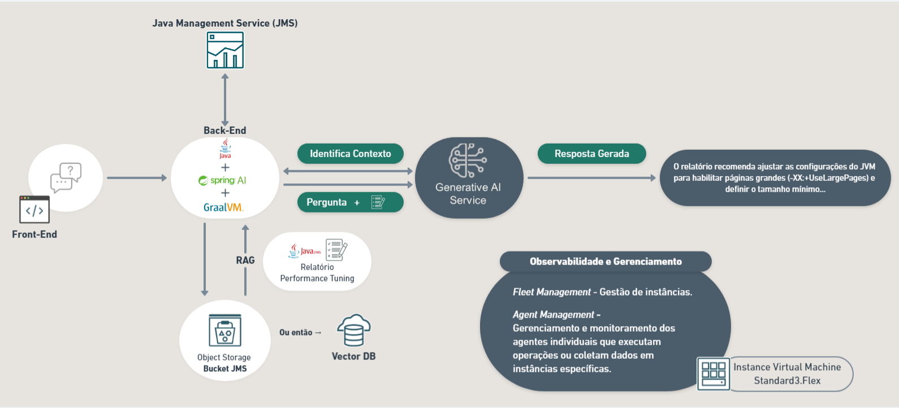

# Potencializando o Desenvolvimento de Aplicações com Java Management e GraalVM: Aprimorando sua cultura DevSecOps com GenAI 
Não pode comparecer mas gostaria de assistir e ver como foi? 
Acesse: [JavaDay - Assistir](https://videohub.oracle.com/media/JavaDay+-+Oracle+28_08_24/1_044ld0my/158145621)

Este repositório contém um projeto demonstrativo que integra uma variedade de tecnologias avançadas para potencializar o desenvolvimento de aplicações Java. 

Utilizando Spring AI, Oracle Gen AI, GraalVM, Oracle Kubernetes Engine (OKE), OCI DevOps e Oracle Java Management Service, este projeto exemplifica como aprimorar sua cultura DevSecOps com a inclusão de inteligência artificial generativa (GenAI) e práticas modernas de gerenciamento de código. 

O repositório apresenta **duas arquiteturas** distintas: uma versão **simplificada** para uma visão geral rápida e uma versão **OKE + Pipeline Devops** para um entendimento aprofundado da prática Devops Java e sua integração no ecossistema Oracle Cloud Infrastructure (OCI).

### Simplificada
 

### OKE + Pipeline Devops
  
